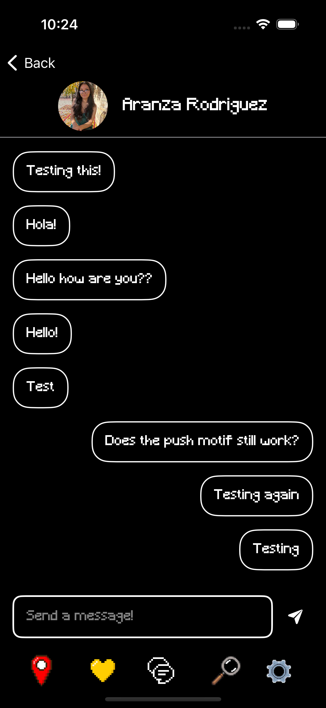

# Frenz ❤️
Frenz is a Yalies-only friend-making/dating app. It allows users to send virtual gifts, message users, look-up other users, view profiles and update their own profile. Please read on to see some of the cool features the app leverages!

## User(s) Profile

### Profile

Students can view other users' profile via a card deck. This card deck is updated each time a student pressed the "New Users" button (bottom right corner) and displays 6 random users at a time. When a student clicks on a user's card, they are able to see more about them, including images and answers to witty prompts.

### Profile Gifts

When a student scrolls to the bottom, they are able to send either "romantic" or "friend" gifts. This depends on the tab they're currently in (as shown in the first image, there is a white/black slider tab). The third image dispaly a set of "friend" gifts one could send.

  
  
  

## Gifts & Messages

### Gifts

Students can send other users either "friend" or "romantic" gifts. A logged-in student can see the gifts they have received by going to the "chat" tab. For example, the first image below shows that the user has received a "romantic" gift (as indicated by the red color of the rim) as well as the profile image of the student who sent the gift. 

### Messages

If a user accepts the user, this initiates a conversation between both parties. Both users can send each other messages, which activates apple push notifications. 

  
  
  

